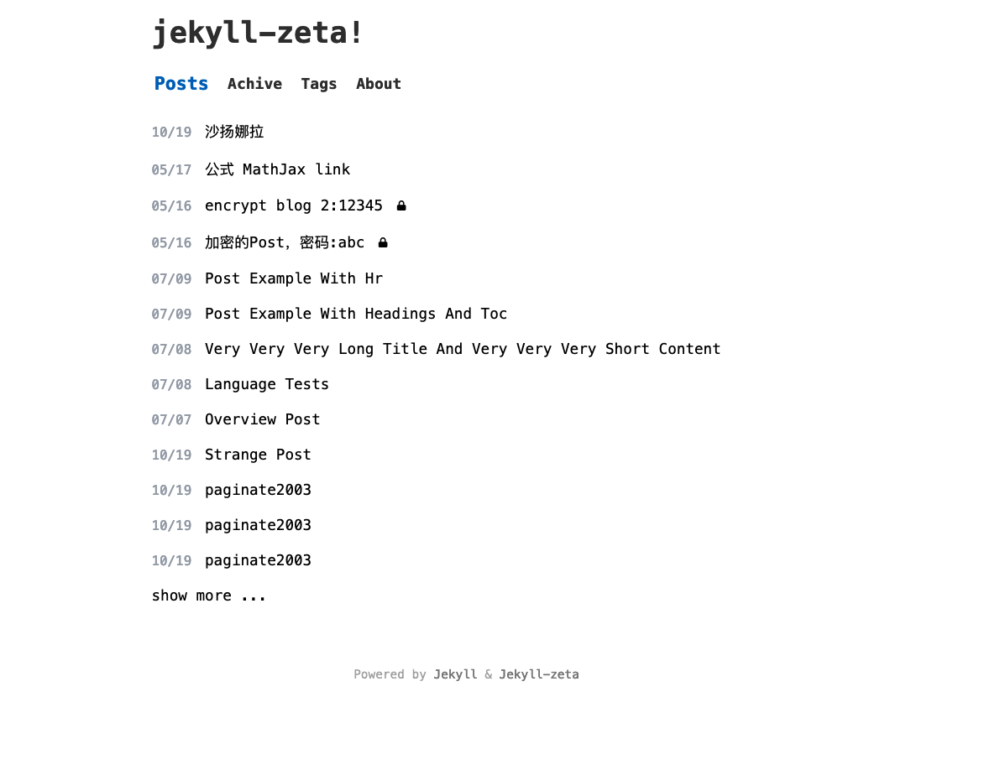

# jekyll-zeta


 
## Features


  + paginate support
  + tags support 
  + mathjax , inluce_code post_link support, include  support, link to other post 
  + encrytion support. Only those who know the password can view the article

  **IMPORTANT NOTE**
  ONLY textual contents of article will be encrypted ,the pictures will  **NOT** be encrypted

  
  #### how to encrypt your post
      1. generate your own public & private key to protect your password
```
ltectool g
```
    you will get 
  ```
publickey: AAA
privatekey: BBBBB
  ```

      2. encrypt your password 


  ``` bash
   # ltectool e [your publickey] [your password]
   # like below
   ltectool e Arkuf0hG0sjifj+G57o4gwPgnXXD72kIhjhSGjyyGCdS 123

   # output
AQAQACAAIQCVKE9YHFT4pzyMa84kqGK+4Olo3EeDlymDa0oZcsQ48j8S4D4fMFb37gUT4LgrxZQDCFLa402i9VhhMIYWXZP+WSsv2Ia+uQpEH5vYKgDR5vL4xXC/76wXl3K7abU7u9du

  ```
   you get your encrypted password ,
   then put it in  `_config.yml`

```yaml
enc_tags:
    - tag: encrypt1 
      password: "123"  # plain text ,NOT recommended

    - tag: encrypt2
      # 123
      password: AQAQACAAIQCVKE9YHFT4pzyMa84kqGK+4Olo3EeDlymDa0oZcsQ48j8S4D4fMFb37gUT4LgrxZQDCFLa402i9VhhMIYWXZP+WSsv2Ia+uQpEH5vYKgDR5vL4xXC/76wXl3K7abU7u9du
```
   add JEKYLL_EC_PRIVATEKEY to ENV   before you run jekyll build 
   or set JEKYLL_EC_PRIVATEKEY to your CI environment
   ``` bash
    #export set JEKYLL_EC_PRIVATEKEY=[Private key]
    export set JEKYLL_EC_PRIVATEKEY="NWWtiQbDnSDvTdogCzAjqNqHGTZrRXdmXQrEKiv3vNs="
   ```

**for security, I recommend you to use different repos to store your source files and the `_site` files**   

+ ### origin:
  * Fast (**1kb of CSS!** For more information on performance and more, see [Page Speed Insights report](https://raw.githubusercontent.com/riggraz/no-style-please/master/_screenshots/page-speed-insights-report.png) and [Lighthouse report](https://raw.githubusercontent.com/riggraz/no-style-please/master/_screenshots/lighthouse-report.png))
  * Light, dark and auto modes
  * Responsive
  * Content first (typography optimized for maximum readability)
  * ~~SEO optimized (uses [Jekyll SEO Tag](https://github.com/jekyll/jekyll-seo-tag))~~
  * ~~RSS feed (uses [Jekyll Feed](https://github.com/jekyll/jekyll-feed))~~
  * ~~Fully compatible with [GitHub Pages](https://pages.github.com/) (see [GitHub Pages installation](#github-pages-installation))~~
  > you should build the _site by yourself , because githubpage do not support all plugins


## Installation

If you haven't already created your blog using Jekyll, follow the [instructions](https://jekyllrb.com/docs/) to do so from Jekyll's documentation.

NOTE: if you are using Jekyll with GitHub Pages, see the [GitHub Pages installation section](#github-pages-installation).

Then, to style your blog with this theme, add this line to your Jekyll site's `Gemfile`:

```ruby
gem "jekyll-zeta"
```

And add this line to your Jekyll site's `_config.yml`:

```yaml
theme: jekyll-zeta
```

And then execute:

    $ bundle

Or install it yourself as:

    $ gem install jekyll-zeta
 
### Customize the menu


edit the `theme_config > menu` in  _config.yml .

here bellow is the default value
``` yml
theme_config:
  menu:
    - title: Home
      url: /
    - title: Achive
      url: /archive.html
    - title: Tags
      url: /tags.html
    - title: About
      url: /about.html
```


 ### Show all tags
create a `tags.md` with content below
``` yml
---
title: TAGS
layout: tags
permalink: /tags/index.html
---
```

add a entry in the _data/menu.yml
``` yml
- title: tags
  url: tags
```

 